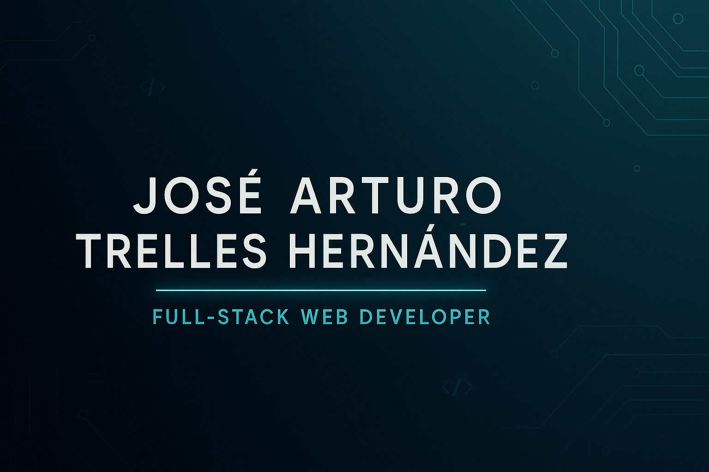

<!-- Optional banner (recommended size: 1584×396) -->

  

<h1 align="center">👋 Hey there! I'm José Arturo Trelles</h1>

  <b>Junior Backend / Full-Stack Developer</b> — Java (Spring Boot), REST APIs, JPA/Hibernate, JWT, PostgreSQL/MySQL

  
  
  

## 🚀 Summary
Junior backend engineer focused on building clean, testable **REST APIs** with **Java 17 + Spring Boot**, secured with **Spring Security/JWT**, and backed by **PostgreSQL/MySQL/H2** via **Spring Data JPA**. Comfortable with **JUnit/Mockito**, basic CI/CD on GitHub, and frontend fundamentals (**HTML/CSS/JS**, **React/Angular**). I also bring a background in **data analysis & machine learning** (EDA, feature engineering, clustering/classical ML) and care about performance fundamentals (multithreading basics, pipeline optimization).

## 🛠 Tech Stack

  
  
  
  
  
  
  
  
  
  
  
  
  
  
  
  
  

<!-- Optional illustration on the right -->

## 📦 Projects
- **EcommerceH2** — Spring Boot + H2 e-commerce backend (CRUD for products, categories, orders). Includes documented endpoints and Postman/Insomnia tests.  
  Repo: https://github.com/ArturoTrelles91/ecommerceH2
- **Quiz Forum API** — Spring Boot + Spring Security with **JWT**; role-based auth; endpoints for user registration, quiz creation, and participation.  
  Repo: https://github.com/ArturoTrelles91/api_foro_alura
- **LiterAlura** — Console app (Spring + PostgreSQL) that searches the **Gutendex** API and stores books; list by title, author, and language.  
  Repo: https://github.com/ArturoTrelles91/literAlura
- **Glucose Tracker App** — React web app to log and visualize glucose levels with charts and CSV export.  
  Demo: https://qwmf7f-3000.csb.app/

## 📊 GitHub Analytics

  
  

  

## 🎓 Education
- **Alura LATAM / Oracle Next Education (ONE)** — Backend specialization with Java & Spring Boot (2025).  
- **UNAM – Institute of Astronomy** — PhD in Computational Astrophysics (HPC, data pipelines, ML) (2024).  
- **UNAM – Institute of Astronomy** — MSc in Astrophysics (2019).  
- **UNAM – Faculty of Sciences** — BSc in Physics (2016).

## 📜 Selected Certifications

- **Java & Spring Framework Specialization – ONE (102h), Alura LATAM** — 
  [View certificate](https://app.aluracursos.com/user/trelles91n-n/fullCertificate/96c90c0da72e1bab58eddac45a60e79e)
- **SQL: A Practical Introduction – Coursera** — 
  [Verify: 54HRY2NYJB5R](https://www.coursera.org/account/accomplishments/verify/54HRY2NYJB5R)
- **IBM Java Developer – Coursera**
  - [Object Oriented Programming in Java — ENUJ2SRIB6JI](https://www.coursera.org/account/accomplishments/verify/ENUJ2SRIB6JI)
  - [Spring Framework for Java Development — 8BWMSKR6VHIL](https://www.coursera.org/account/accomplishments/verify/8BWMSKR6VHIL)
  - [Java Programming (IBM) — ZU4RW5Y5ER6U](https://www.coursera.org/account/accomplishments/verify/ZU4RW5Y5ER6U)
- **Modern JavaScript – The Complete Full-Stack Web Development Bootcamp (Udemy)** — 
  [View certificate](https://www.udemy.com/certificate/UC-e92f6340-b1f7-4292-89de-cae3131209c4/)
- **Python for Data Science, AI & Development – Coursera** — 
  [Verify: GRIV13PVO2W3](https://www.coursera.org/account/accomplishments/verify/GRIV13PVO2W3)
- **A Tour of Google Cloud Hands-on Labs – Coursera** — 
  [Verify: MELLF0L0WE2I](https://www.coursera.org/account/accomplishments/verify/MELLF0L0WE2I)
- **Google Cloud Fundamentals: Core Infrastructure – Coursera** — 
  [Verify: U18942HZ5DQ2](https://www.coursera.org/account/accomplishments/verify/U18942HZ5DQ2)
- **Cloud Native, Microservices, Containers, DevOps and Agile** —
  [Verify: d232c5b8ae09296e9250b344dc4c74bc](https://coursera.org/share/d232c5b8ae09296e9250b344dc4c74bc)

## 📫 Contact
- 📧 Email: **trelles91n.n@gmail.com**  
- 🔗 LinkedIn: **https://www.linkedin.com/in/arturo-trelles-h**  
- 💻 GitHub: **https://github.com/ArturoTrelles91**

---

<i>Build · Measure · Learn</i>

